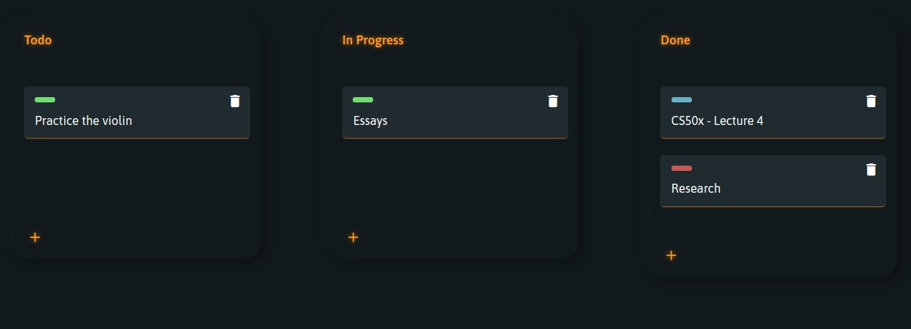
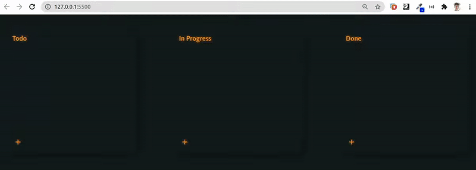

# simple-kanban
This is a web page that replicates the most common Kanban templates (Todo, Progress and Done). It was made for learning purposes, using only HTML, CSS and pure JS.  

<h2 align='center'>
      
</h2>

  

  

  

<h3>Features</h3>  
<ul>
  <li>Draggable Cards</li>
  <li>Creating Cards</li>
  <li>Deleting Cards</li>
  <li>Local Storage Save</li>
</ul>

<h3 href>Demo</h3>

See the live demo <a href="https://fabiopapaiss.github.io/simple-kanban">(click here)</a>

<h2 align='center'>
      
</h2>
    
<h3>Show your support</h3>  

Give a ⭐️ if this project helped you!

---

Made with ♥ by Fabio Papais :wave: [Get in touch!](mailto:fabiopapais@hotmail.com)
